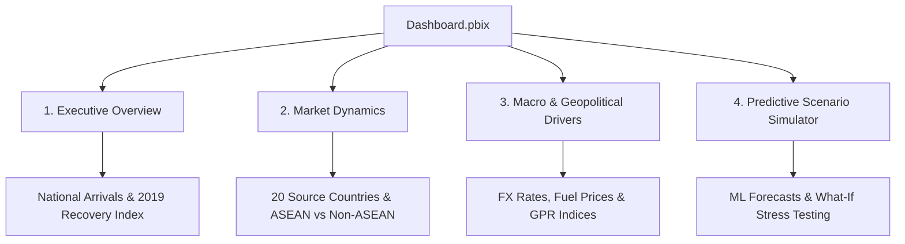

# 📊 Microsoft Power BI Interactive Dashboard Package

**Team**: Nexora  
**Competition**: Department of Statistics Malaysia (DOSM) Datathon 2026  
**Deliverable Archive**: `Nexora_Datathon2026_Dashboard.zip`  
**Software**: Microsoft Power BI Desktop (September 2026 Release / Version 2.120+ 64-bit)  

---

## 📂 Package Contents

This folder contains the interactive Power BI dashboard assets for the Preliminary Round submission. Per official competition rules, all four files are packaged together into `Nexora_Datathon2026_Dashboard.zip`:

| File Name | Format | Purpose & Specification |
| :--- | :---: | :--- |
| **`Dashboard.pbix`** | `.pbix` | Master interactive Power BI report with dynamic slicers, cross-filtering, and scenario simulator |
| **`Dashboard.pdf`** | `.pdf` | High-resolution static overview of all dashboard report pages for quick offline grading |
| **`Data.csv`** | `.csv` | Cleaned underlying flat dataset (UTF-8 encoded) powering the data model |
| **`README.txt`** | `.txt` | Plain-text instructions required by the official DOSM Datathon submission rules |

---

## 🖥️ System & Software Requirements

* **Application**: Microsoft Power BI Desktop (Available for free via Microsoft Store or Microsoft official site)
* **Recommended Version**: September 2026 or later (compatible with any version 2.120+ 64-bit)
* **Required Plugins / Visuals**: **Zero external or custom plugins required**. 100% of charts use native Microsoft core visual components to guarantee seamless opening on any judge's device.
* **Connectivity**: Self-contained **Import Mode** data model. No external cloud gateway, database connection, or authentication credentials are required to interact with the dashboard.

---

## 🚀 Step-by-Step: How to Open and Run

1. **Launch Power BI Desktop**: Open Microsoft Power BI Desktop on Windows.
2. **Open the Report**:
   * Double-click `Dashboard.pbix` in File Explorer, or
   * Go to **File** $\rightarrow$ **Open report** $\rightarrow$ **Browse reports**, and select `Dashboard.pbix`.
3. **Load Model**: If prompted to refresh or apply query changes, select **Apply Changes** or **Load**. The pre-aggregated model will immediately display all visuals.
4. **Offline / Fast Reference**: Evaluators can also view `Dashboard.pdf` for an immediate high-resolution multi-page PDF export.

---

## 📑 Report Structure & Analytical Views

The dashboard is organized into four intuitive analytical views:

### 1. Executive Overview & Tourism Recovery
* **High-Level KPIs**: Total Tourist Arrivals, Year-over-Year (YoY) Growth %, ASEAN vs. Non-ASEAN Contribution %, and Recovery Ratio compared to the 2019 Pre-Pandemic Baseline.
* **National Time Series**: 10-year arrival trajectory tracking historical seasonality, disruption troughs, and post-2022 recovery paths.

### 2. Origin Market Dynamics (ASEAN vs. Non-ASEAN)
* **20 Origin Markets**: Granular breakdown across ASEAN (7 countries: Brunei, Indonesia, Myanmar, Philippines, Singapore, Thailand, Vietnam) and Non-ASEAN (13 countries: China, India, UK, Australia, Japan, South Korea, etc.).
* **Seasonality Heatmaps**: Visualizes peak travel periods and holiday patterns across individual source markets.

### 3. Macroeconomic & Geopolitical Drivers
* **Currency Affordability**: Bilateral foreign exchange rates (MYR per source currency) from Bank Negara Malaysia.
* **Energy & Transport Costs**: Brent Crude (USD/bbl) and domestic retail fuel prices (RON95, RON97, Diesel).
* **Geopolitical Risk (GPR)**: Correlation of global conflict indicators with international travel fluctuations.

### 4. Predictive Analytics & Scenario Simulator
* **Machine Learning Forecasts**: Projected tourist arrivals over the competition hold-out evaluation horizon.
* **Interactive What-If Controls**: Sliders to simulate tourism demand elasticity under varying exchange rate shifts and oil price shocks.

---

## 🕹️ Interactive Controls & Navigation

* **Global Slicers**: Filter across **Year** (2017 to 2026), **Month**, **Market Segment**, and **Source Country**.
* **Dynamic Cross-Filtering**: Click any bar, column, or segment to highlight and filter related charts across the active canvas.
* **Interactive Tooltips**: Hover over line charts and data markers to view precise counts, growth percentages, and FX rates.
* **Reset Visuals**: Click the **Reset All Filters** button located at the top-right corner of each page to restore default views.

---

## ⚙️ Limitations & Assumptions

* **Temporal Scope**: March 2017 through September 2026 (Monthly aggregated frequency).
* **Hold-Out Split**: Arrival targets in the hold-out evaluation window are designated for competition model evaluation and visualized as model projections.
* **Currency Base**: All bilateral exchange rates are expressed relative to the Malaysian Ringgit (MYR).
